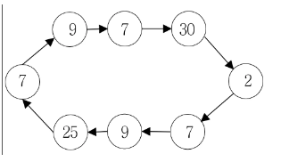

# 에디터

## 문제
한 줄로 된 간단한 에디터를 구현하려고 한다. 이 편집기는 영어 소문자만을 기록할 수 있는 편집기로, 최대 600,000글자까지 입력할 수 있다.

이 편집기에는 '커서'라는 것이 있는데, 커서는 문장의 맨 앞(첫 번째 문자의 왼쪽), 문장의 맨 뒤(마지막 문자의 오른쪽), 또는 문장 중간 임의의 곳(모든 연속된 두 문자 사이)에 위치할 수 있다. 즉 길이가 L인 문자열이 현재 편집기에 입력되어 있으면, 커서가 위치할 수 있는 곳은 L+1가지 경우가 있다.

이 편집기가 지원하는 명령어는 다음과 같다.

초기에 편집기에 입력되어 있는 문자열이 주어지고, 그 이후 입력한 명령어가 차례로 주어졌을 때, 모든 명령어를 수행하고 난 후 편집기에 입력되어 있는 문자열을 구하는 프로그램을 작성하시오. 단, 명령어가 수행되기 전에 커서는 문장의 맨 뒤에 위치하고 있다고 한다.

## 입력
첫째 줄에는 초기에 편집기에 입력되어 있는 문자열이 주어진다. 이 문자열은 길이가 N이고, 영어 소문자로만 이루어져 있으며, 길이는 100,000을 넘지 않는다. 둘째 줄에는 입력할 명령어의 개수를 나타내는 정수 M(1 ≤ M ≤ 500,000)이 주어진다. 셋째 줄부터 M개의 줄에 걸쳐 입력할 명령어가 순서대로 주어진다. 명령어는 위의 네 가지 중 하나의 형태로만 주어진다.

## 출력
첫째 줄에 모든 명령어를 수행하고 난 후 편집기에 입력되어 있는 문자열을 출력한다.

### 예제
abcd
3
P x
L
P y
답: abcdyx

abc
9
L
L
L
L
L
P x
L
B
P y
답 : yxabc

dmih
11
B
B
P x
L
B
B
B
P y
D
D
P z
답 :yxz
## 느낀점
시간초과 가 계속 나서 도저히 생각을 못하겠어서 인터넷을 뒤졌다.
리스트 이터레이터를 발견했고, 스택으로도 구현할수 있다는걸 알았다.
다음번에 는 이터레이터 나 스택으로도 구현할수 있는지 생각을 해야겠다.